# Servo Receiver with DE0-Nano-SoC
Projet du cours d'Hardware/Software à la Faculté Polytechnique de Mons, année académique 2022-2023. 

Membres du groupe : Tom LEROY (tom.LEROY@student.umons.ac.be), Maxime VANDENHENDE (maxime.VANDENHENDE@student.umons.ac.be) et Léo VANDER BEKEN (leo.VANDERBEKEN@student.umons.ac.be)

Dans le cadre du cours d'Hardware/Software, il nous est demandé de lire des données envoyées par un servo moteur à l'aide du kit de développement DE0_Nano_SoC. Ces données sont en fait la période signal envoyé par le servo moteur. Pour ce faire, nous allons proposer un tutoriel sur la méthodologie à adopter pour y arriver. 
Ce dernier va être diviser en 2 parties principales : l'Hardware et le Software. 

1) Partie Hardware :

Dans cette partie, le responsable Hardware va devoir choisir et implementer les I/O dans les différents codes ".vhd". Ainsi, en faisant tourner ces codes, le logiciel "Quartus" nous donne le "Platform Designer" tel que le démontre la figure suivante :

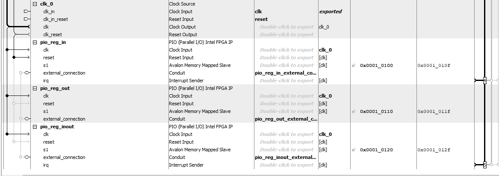

De plus, il doit compléter le "FPGA_TOP.v" pour ajouter le bloc relatif à ce projet contenant les I/O, clk, rst, ... utilisés comme dans la figure suivante :

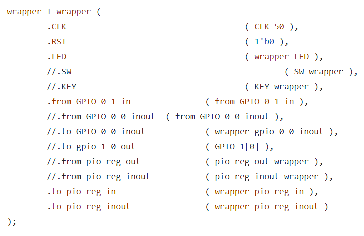

Ensuite, il devra écrire un programme mettant en place un compteur et un lecteur de fréquence. Celui-ci est le lien entre les parties Hardware et Software. Le compteur relèvera le nombre de battements d'horloge entre 2 états permettant ensuite à la détermination de la fréquence. Cela est démontré dans le fichier "ServoIn.vhd" dont voici le code commenté :  

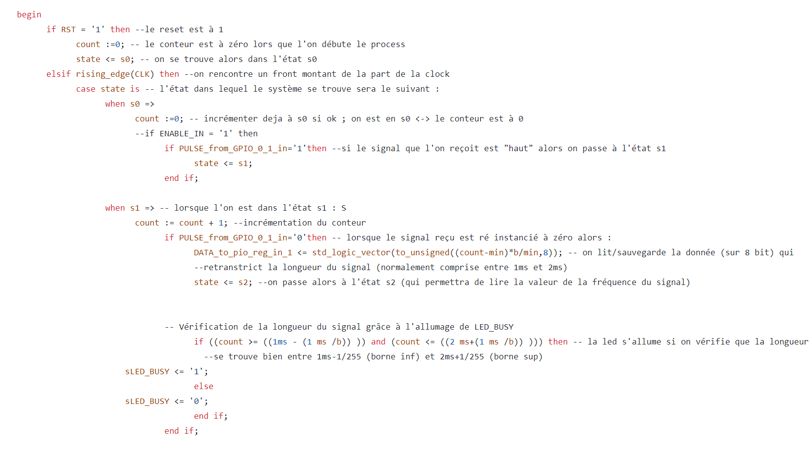

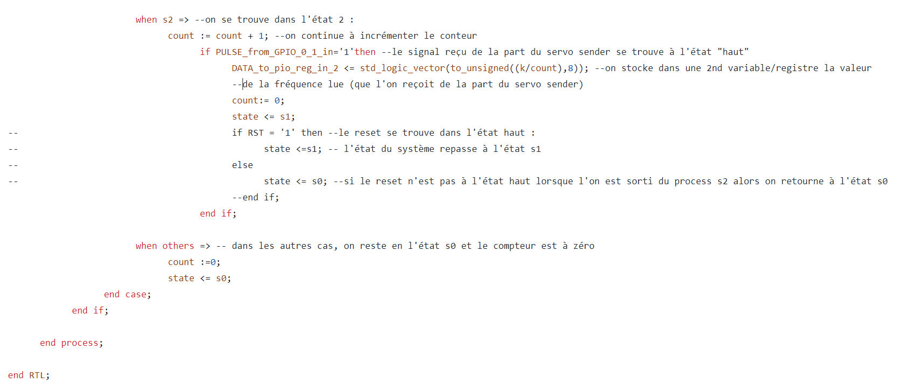

On peut d'ailleurs observer sur RTL view, généré grâce à notre code, une représentation de la connexion entre la FPGA, le wrapper, le driver et la SoC. 
A gauche (en rouge), on peut observer la connexion de la FPGA avec le wrapper : "CLK", "RST" et et "from_GPIO_0_1_in" (le dernier est le pin par lequel vont arriver les données). Ensuite, une fois dans le wrapper, il y a la connexion entre le wrapper et le driver via les pins : "CLK", "RST" et "PULSE_from_GPIO_0_1_in". 
Le 2ème nom des pins du driver change de celui du wrapper car il pourrait y avoir plusieurs drivers, il faut donc pouvoir différencier les pins des différents drivers, d'où le nom différent. Par contre, les pins la clock et le reset étant identique tout le temps, pas besoin de modifier leurs noms entre le wrapper et les drivers. 
Ensuite, en sortie du driver, on observe les pins "DATA_to_pio_reg_in1", "DATA_to_pio_reg_in2", "LED_BUSY" et "LED_DRDY". Ensuite, la connexion de la sortie du driver avec la sortie du wrapper se fait au niveau des pins de sortie du wrapper nommés : "to_pio_reg_in", "to_pio_reg_inout" et "LED". IL est à noter qu'initialement, le pin "DATA_to_reg_in2" était utilisé pour transmettre la valeur de la fréquence mais finalement celle-ci est traitée directement au niveau de l'Hardware, dans le fichier "ServoIn.vhd". 

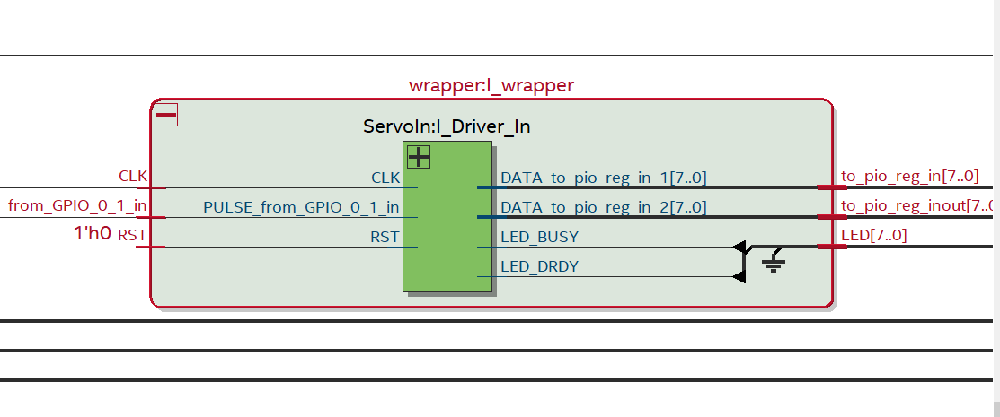

La connexion entre le wrapper et le driver peut d'ailleurs être observée dans le fichier "wrapper.vhd" . Voici le code en question : 

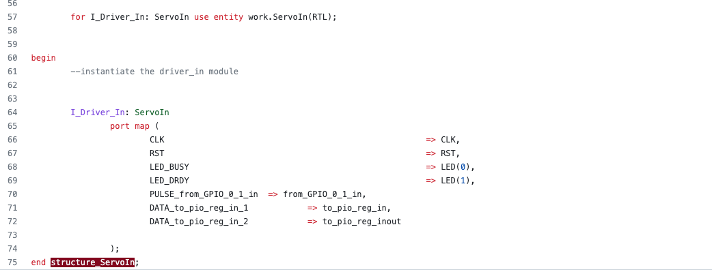

Enfin, il devra créer un TestBench à partir du fichier "ServoIn_TB.vhd" afin de simuler le comportement du programme cité ci-dessus.

Le signal à une période 20 ms comme on peut voir à l'image suivante : 
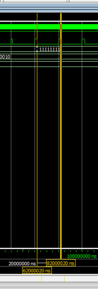

Ensuite, les pulsations doivent durer entre 1 et 2 ms. En effet, les pulsations de 1ms correspondent à un angle de 0° et celles de 2ms correspondent à un angle de 180°. On peut d'ailleurs observer des pulsations de 1ms (0°), 1.5 ms (90°) et 2 ms (180°) dans les figures suivantes : 

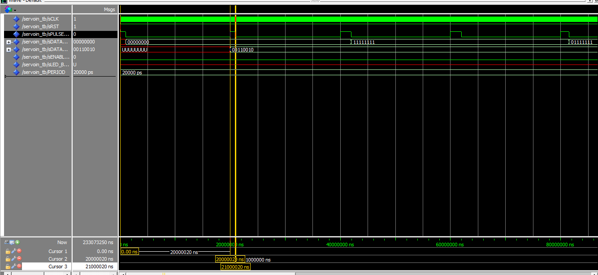
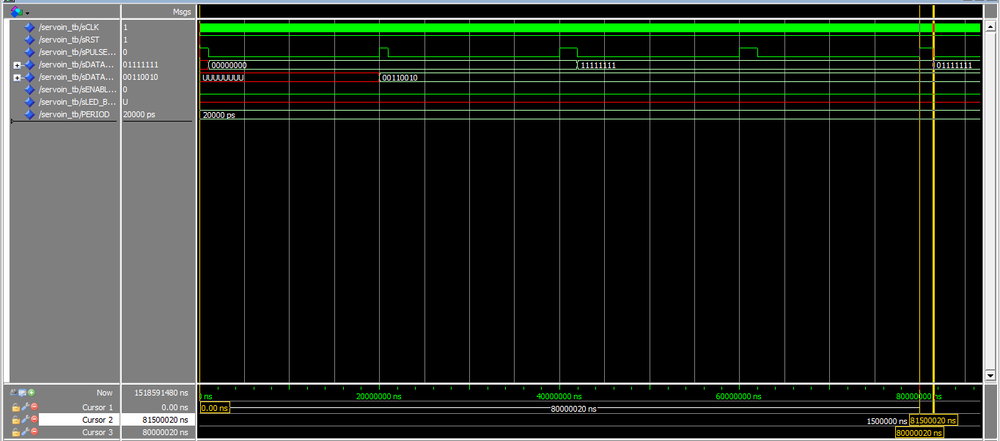
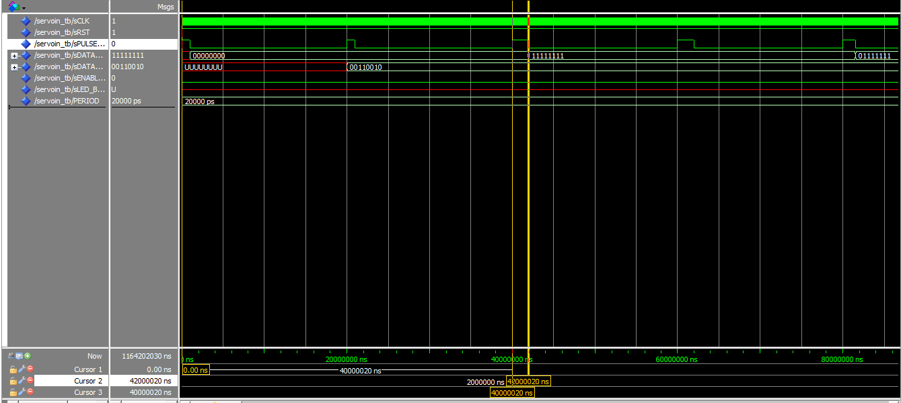

Et donc grâce au compteur de 8 bits, on retrouve la valeur de notre angle : 

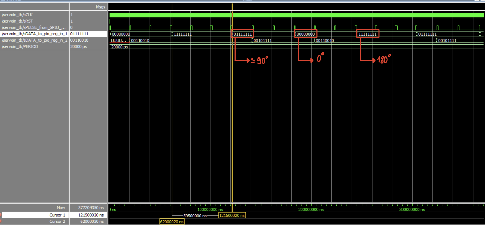

Ainsi on peut observer la valeur de l'angle. 

2) Partie Software : 

Dans cette partie, le responsable Software va devoir créer la foction permettant de lire les données envoyées par la partie Hardware et de transformer ces données en valeur d'angle dans le fichier "driver.c". Cette fonction s'appelle "servo_robert()" et se définit comme suit : 

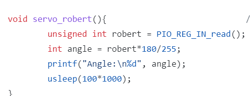

Ensuite, il va falloir modifier le fichier main.c, afin de permettre d'afficher les informations reçues par la partie Hardware. En d'autres mots, afficher la valeur de l'angle determinée grâce au compteur. Voici le code : 
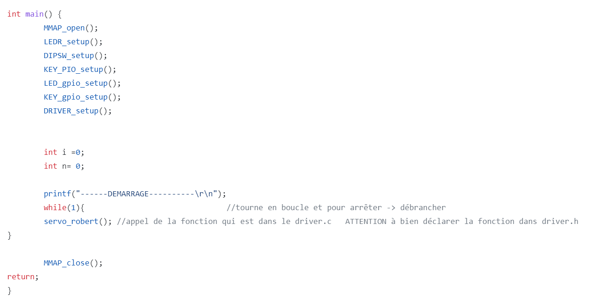

En lisant le code, on peut voir que la fonction "servo_robert()" est appelée afin de lire les données venant du Hardware et les transformer en valeur d'angle. De plus, étant donné qu'il y a une boucle "while(1)", le code va afficher en continu la valeur d'angle lue jusqu'au moment où on débranche tout. De plus, on peut observer que plusieurs fonctions sont appelées. Tout d'abord, il y a la la fonction "MMAP_OPEN()". Celle-ci récupère les adresses des différents pins. Il y a aussi la fonction "DRIVER_SETUP()". Si on regarde comment est définie cette fonction dans le fichier "driver.c", on observe que d'autres fonctions sont appelées dans celle-ci : "PIO_REG_IN_setup()", "PIO_REG_OUT_setup()" et "PIO_REG_INOUT_setup()". Ces fonctions servent à récupérer les adresses formatées au préalable dans le fichier "mmap_hw_regs.c". 

De plus, le responsable devra tester le programme en utilisant une carte PIC qui simulera un Servomoteur. Les valeurs de l'angle lue sur la carte PIC et sur l'ordinateur devront donc être égales. 

 
