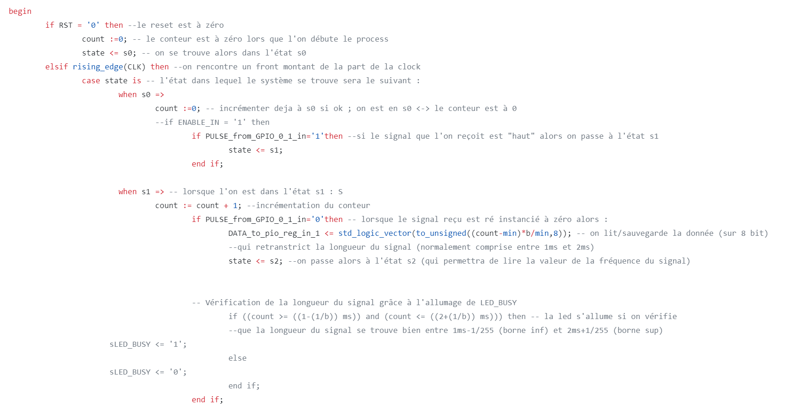
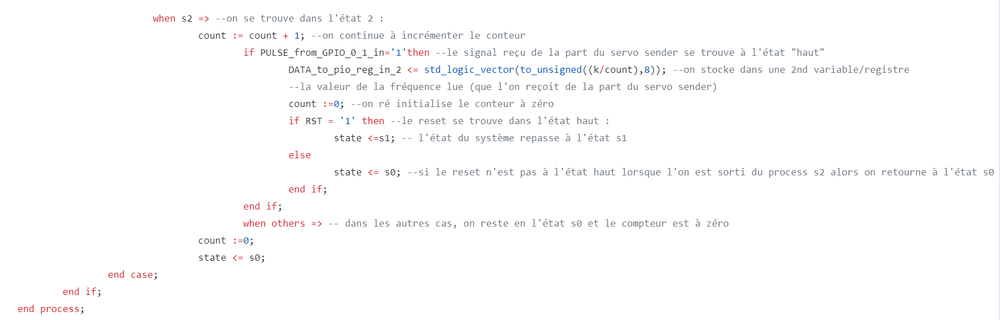
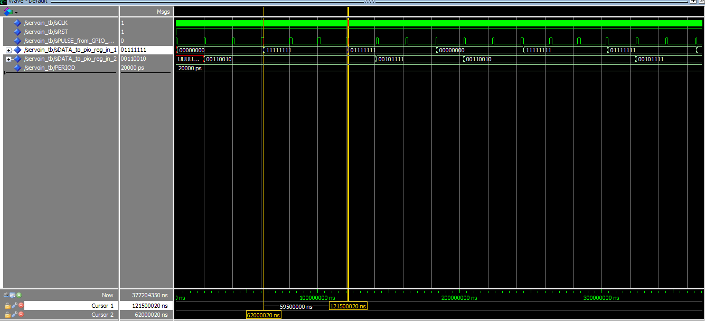

# Servo Receiver with DE0-Nano-SoC
Projet du cours d'Hardware/Software à la Faculté Polytechnique de Mons, année académique 2022-2023. 

Membres du groupe : Tom LEROY (tom.LEROY@student.umons.ac.be), Maxime VANDENHENDE (maxime.VANDENHENDE@student.umons.ac.be) et Léo VANDER BEKEN (leo.VANDERBEKEN@student.umons.ac.be)

Dans le cadre du cours d'Hardware/Software, il nous est demandé de lire des données envoyées par un servo moteur à l'aide du kit de développement DE0_Nano_SoC. Ces données sont en fait la période signal envoyé par le servo moteur. Pour ce faire, nous allons proposer un tutoriel sur la méthodologie à adopter pour y arriver. 
Ce dernier va être diviser en 2 parties principales : l'Hardware et le Software. 

1) Partie Hardware :

Dans cette partie, le responsable Hardware va devoir choisir et implementer les I/O dans la fonctionnalité "Platform Designer" du logiciel "Quartus" tel que le démontre la figure suivante :

De plus, il doit compléter le "FPGA_TOP" pour ajouter le bloc relatif à ce projet contenant les I/O, clk, rst, ... utilisés comme dans la figure suivante :

Ensuite, il devra écrire un programme mettant en place un compteur et un lecteur de fréquence. Celui-ci est le lien entre les parties Hardware et Software. Le compteur relèvera le nombre de battements d'horloge entre 2 états permettant ensuite à la détermination de la fréquence. Cela est démontré dans le fichier "ServoIn.vhd" dont voici le code commenté :  

Enfin, il devra créer un TestBench à partir du fichier "ServoIn_TB.vhd" afin de simuler le comportement du programme cité ci-dessus.

Le signal à une période 20 ms comme on peut voir à l'image suivante : 

Ensuite, les pulsations doivent durer entre 1 et 2 ms, ce qui est confirmé dans les images suivantes : 

Et donc grâce au compteur de 8 bits, on retrouve la valeur de notre angle : 

Ainsi on peut observer la valeur de l'angle. 

2) Partie Software : 

Dans cette partie, le responsable Software va devoir modifier le programme main.c envoyé sur le processeur. Celui-ci permet d'afficher les informations reçues par la partie Hardware. En d'autres mots, afficher la fréquence determinée grâce au compteur et au lecteur de fréquence. De plus, le responsable devra connecter le processeur à l'ordinateur, d'y envoyer les programmes nécessaires et de le faire fonctionner. Pour finir, il faudra lire les signaux reçus via le processeur à partir de l'oscilloscope. 

 
